# MIAO 用户手册

把团队的工作变成自己的应用。本手册面向企业负责人、应用创建者、工作区管理员和业务成员，按当前 MIAO 工作台的入口说明如何登录、创建、发布、使用和管理应用。文中的截图与 HTML 页面是**示意原型**，使用虚构数据，用来说明当前产品的结构和操作边界，不代表某个线上账号的实际内容。

## 目录

1. [认识 MIAO](#认识-miao)
2. [开始使用](#开始使用)
3. [创建应用](#创建应用)
4. [预览与发布](#预览与发布)
5. [团队日常使用](#团队日常使用)
6. [修改应用与版本](#修改应用与版本)
7. [数据、附件与导出](#数据附件与导出)
8. [成员与权限](#成员与权限)
9. [企业治理](#企业治理)
10. [常见问题](#常见问题)
11. [完整示例](#完整示例)
12. [附录：技术架构](#附录技术架构)

## 认识 MIAO

**界面参考：**[HTML 原型](./prototypes/01-overview.html) · [原型图](./prototypes/images/01-overview.png) · [全部原型](./prototypes/)

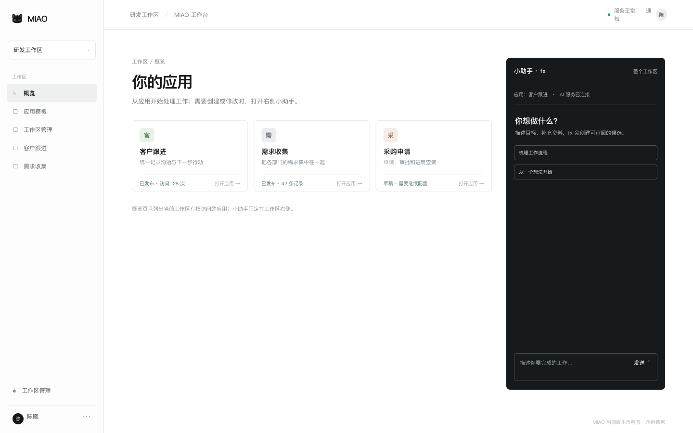

MIAO 是一个服务端 Agent 驱动的企业工作台。登录后进入当前工作区，概览页列出你有权访问的应用；已经发布的应用用于处理日常业务，草稿应用等待继续配置。创建或修改应用时，从右侧打开固定的小助手 fx，用自然语言描述目标、补充文件或回答追问。

当前产品有四个清晰入口：

1. 概览与模板：打开已有应用，或从模板创建一个新的起点。
2. 小助手：创建应用、生成界面草稿、配置业务动作、发布或查询记录。
3. 应用页面：在已发布的列表、详情、表单和任务页中处理业务。
4. 维护入口：按需打开后台任务、查看数据表、应用配置和工作区管理。

管理动作会产生持久化运行记录。涉及创建、写入、发布、扩大公开范围或批量修改时，系统会展示候选和影响范围，由有权成员确认；模型生成的文字不能替代实际写入回执。

| 角色 | 主要工作 | 建议阅读 |
| --- | --- | --- |
| 应用创建者 | 描述需求、检查草稿、配置应用和发布 | 创建应用至修改应用 |
| 业务成员 | 在已发布页面录入、查询和处理记录 | 团队日常使用、数据、常见问题 |
| 工作区管理员 | 邀请成员、管理空间、查看日志和用量 | 成员与权限、企业治理 |
| 平台管理员 | 管理账号、工作区元数据、平台设置和 AI 服务 | 企业治理、技术架构 |

## 开始使用

**界面参考：**[HTML 原型](./prototypes/02-start.html) · [原型图](./prototypes/images/02-start.png)

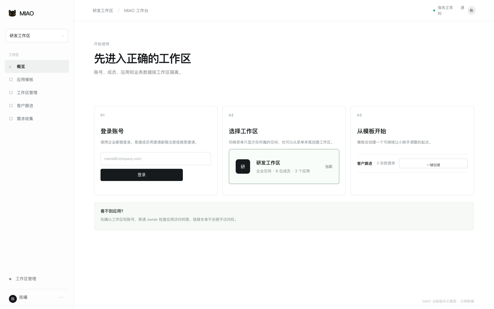

1. 使用企业提供的 MIAO 地址登录。注册策略可能是开放、仅受邀或关闭；如果启用了邮箱验证，先完成验证。
2. 登录后，从左侧工作区菜单选择当前空间。工作区拥有独立的成员、应用、权限和数据；菜单末尾可以创建新工作区。
3. 概览页显示当前空间中你有权访问的应用。应用卡片展示名称、用途、发布状态、最近更新时间和统计占位。
4. 没有合适的应用时，打开“应用模板”，选择客户跟进、需求收集等模板，再交给小助手继续调整。

切换工作区后，应用列表、对话上下文、通知和数据会重新按新空间读取。旧链接也会重新检查成员与应用权限；链接本身不会授予访问权。

### 第一个需求怎么准备

推荐从一个边界清楚、能反复使用的流程开始，提前说明三件事：**谁在做、要记录什么、完成的标准是什么。**例如：“销售记录客户和下次联系日期；负责人每天查看待跟进客户；主管查看本周进展。”

## 创建应用

**界面参考：**[HTML 原型](./prototypes/03-create.html) · [原型图](./prototypes/images/03-create.png)

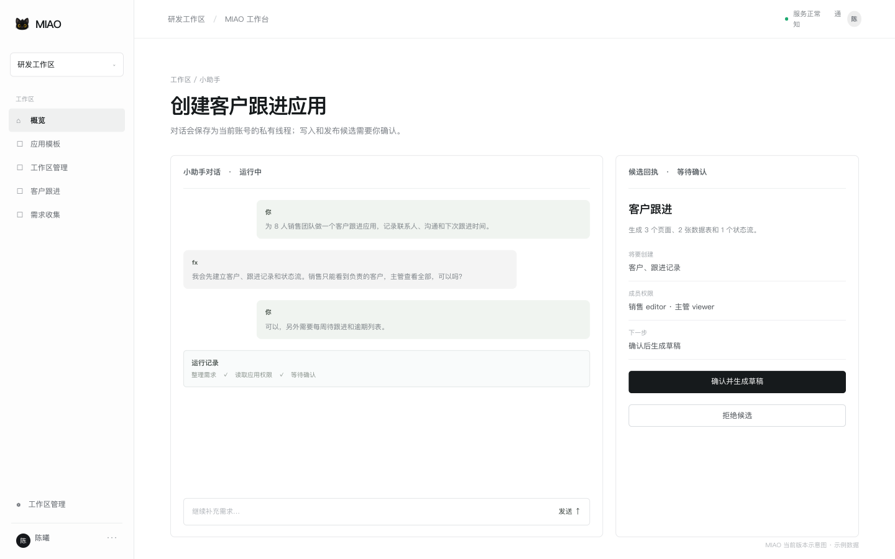

1. 在概览页打开小助手，选择“整个工作区”或一个具体应用作为对话上下文。
2. 描述目标、参与人、要保存的数据、可见范围和完成条件。可以附加 CSV、XLSX、文本、Markdown、PDF 或图片作为参考资料。
3. fx 会追问必要问题，并通过持久化运行记录展示正在进行的阶段、候选操作和是否需要写入确认。
4. 检查候选回执中的应用名称、页面、数据表、业务动作、状态流和权限。确认后才会生成草稿或写入数据。

> **可以直接这样说：**“为 8 人销售团队做一个客户跟进应用，销售录入客户、联系人、最近沟通和下次跟进时间；主管查看本周待跟进与逾期项；销售只能看到自己负责的客户。”

草稿由受控的 schema v3/json-render 运行时渲染。平台不执行用户提交的应用源码、SQL 或任意代码；页面、字段和动作都要通过服务端校验。文件上传最多 5 MB，CSV/XLSX 读取和每批导入最多 100 行。

### 运行记录与确认

小助手运行可能处于排队、处理中、等待确认、成功、失败或待核实状态。关闭页面不会取消运行，重新打开应用或通知中的运行详情可以继续查看。写入结果未知时先核实当前记录，不会自动重放原写入。

## 预览与发布

**界面参考：**[HTML 原型](./prototypes/04-publish.html) · [原型图](./prototypes/images/04-publish.png)

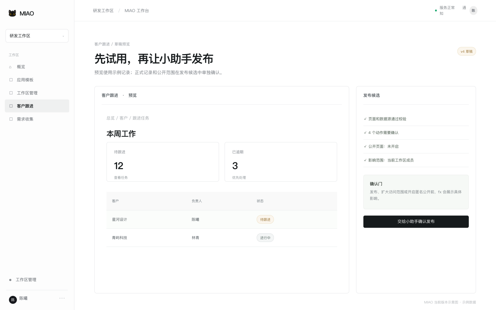

1. 打开草稿预览，逐页检查导航、列表、详情、表单、操作按钮和空状态。预览中的记录是示例数据。
2. 检查数据源、字段白名单、业务动作、状态转换和成员访问范围。需要匿名公开时，再单独检查公开页面、公开字段、发布状态和图片授权。
3. 通过小助手生成发布候选。候选会列出版本、影响范围、是否写入、是否开启匿名公开以及校验结果。
4. 由具有 publisher、owner 或明确发布权限的成员确认。成功后，正式应用只引用已发布版本；失败时现有正式版本继续运行。

预览不隐式写入正式记录。发布不是一个隐藏的前端开关，而是有确认门、权限检查、审计和持久回执的操作。公开发布只读访问已授权的页面和记录，不开放普通附件或未授权字段。

### 发布前检查

- 业务成员能独立完成“打开 → 找到记录 → 处理 → 保存”。
- 每个页面的数据源、字段和动作都已通过校验。
- viewer、editor、manager、publisher 的范围符合实际分工；批量修改另需 `can_batch`。
- 示例数据与真实数据区分清楚；没有记录时页面展示空状态。
- 若开启公开页面，已检查 slug、状态值、SEO 字段和图片授权。

## 团队日常使用

**界面参考：**[HTML 原型](./prototypes/05-work.html) · [原型图](./prototypes/images/05-work.png)

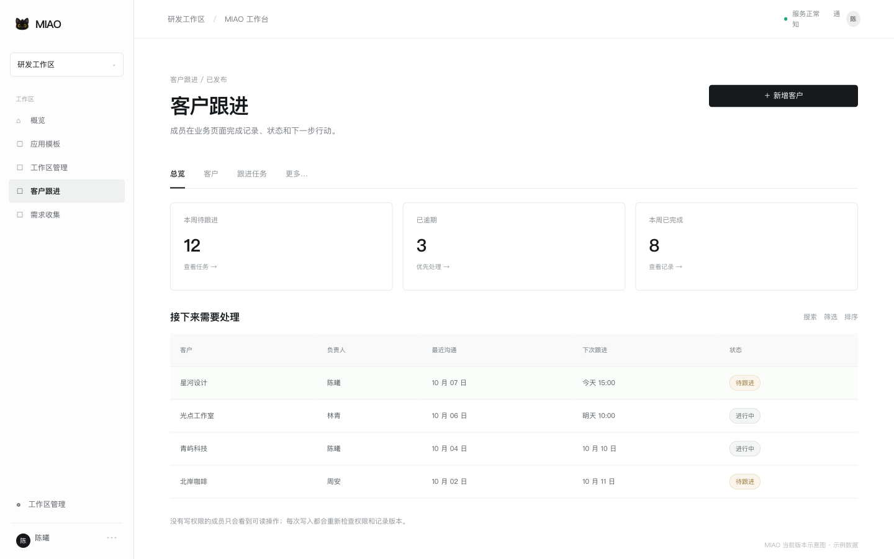

打开应用后，默认进入已发布的业务页面。页面可能包含总览、列表、详情、表单、状态操作和后台任务入口；成员直接在业务界面工作，不必为每一条记录进入 Agent 对话。

### 查找与处理记录

1. 在列表中搜索、筛选、排序并打开详情。
2. 使用页面声明的按钮新增记录、修改字段、推进状态、上传附件或执行已启用的业务动作。
3. 保存时服务端重新检查工作区、应用角色、字段校验和记录的预期更新时间；冲突时先重新读取最新记录。
4. 根据页面反馈确认写入结果。删除、公开、批量修改等高影响操作会显示具体对象和影响并要求确认。

记录分页、搜索和统计来自当前账号获授权的数据。没有写权限的成员不会看到可执行的编辑入口。应用链接可以分享给同事，但同事仍需登录并获得应用访问权限。

### 后台任务、通知和自动化

应用可以通过小助手配置定时、到期、状态变化、新记录或鉴权外部事件触发的后台任务。任务先保存为草稿，启用和运行使用明确的版本；最近运行、步骤、写入数量、通知和失败原因可以在应用的“后台任务”入口查看。站内通知会提示需要确认的运行、发布结果和成员邀请。

声明式采集脚本可以读取无凭据的 HTTP(S) 来源，按声明进行字段映射、过滤、稳定去重、入库和通知。每次运行保存回执；外部页面内容始终视为不可信数据，不能借此扩大任务授权。

## 修改应用与版本

**界面参考：**[HTML 原型](./prototypes/06-change.html) · [原型图](./prototypes/images/06-change.png)

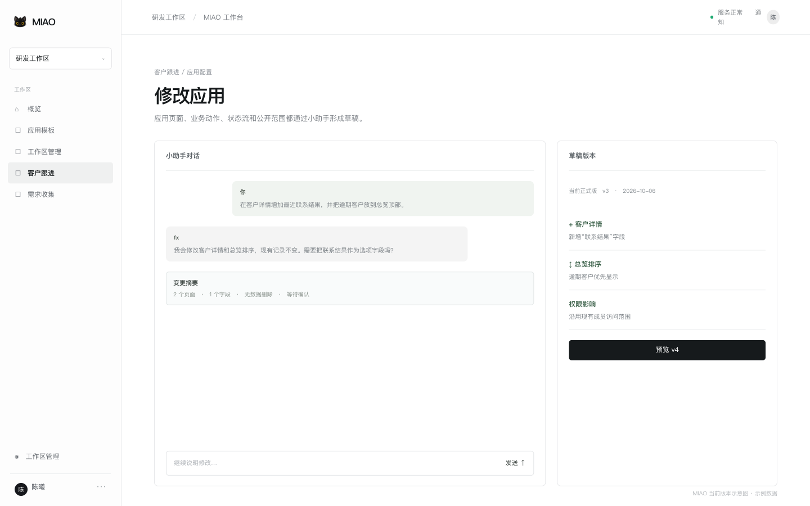

打开应用后，通过小助手说明要改的页面、字段、动作、状态流或公开范围。例如：“在客户详情增加联系结果，并把逾期客户排在总览顶部。”fx 会读取当前应用上下文，生成变更摘要和新的草稿版本。

1. 先阅读受影响的页面、表、字段、动作和成员范围。
2. 预览草稿，确认新增、修改、迁移和删除边界；涉及批量写入时先审阅计划。
3. 由有权成员确认发布。历史版本、发布人、时间、摘要和运行回执会保留。

界面版本回退不会撤销成员已经录入的业务记录。归档应用会从工作区列表隐藏但保留数据，恢复后需要重新确认后续发布；永久删除会要求确认并删除应用及其业务数据。

## 数据、附件与导出

**界面参考：**[HTML 原型](./prototypes/07-data.html) · [原型图](./prototypes/images/07-data.png)

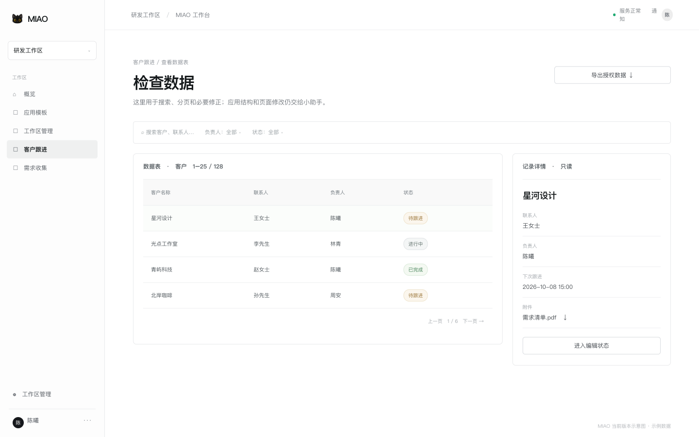

从应用操作区打开“查看数据表”。这里用于按表查看记录、搜索、筛选、排序、分页和必要修正；应用结构、页面和业务规则仍由小助手管理。普通成员进入应用时默认看到业务界面，不会先看到表结构。

附件下载需要重新检查工作区、应用、记录和字段权限。知道文件地址不会让附件变成公开资源；只有公开发布中明确授权的图片字段走公开代理路径。

### 导入、批量修改与导出

- CSV/XLSX 导入先检查字段映射、样本和错误行，再确认写入；单批最多 100 行。
- Agent 的批量修改先生成 1–100 条记录的计划，确认后执行；计划过期、权限变化或记录被修改时会阻止写入。
- 业务动作支持受控的跨表创建/更新步骤，使用输入引用和幂等键；不支持任意 SQL、代码或网络写入。
- 工作区导出只包含发起者有权访问的数据。导出文件按企业内部数据政策保存和传递。

## 成员与权限

**界面参考：**[HTML 原型](./prototypes/08-team.html) · [原型图](./prototypes/images/08-team.png)

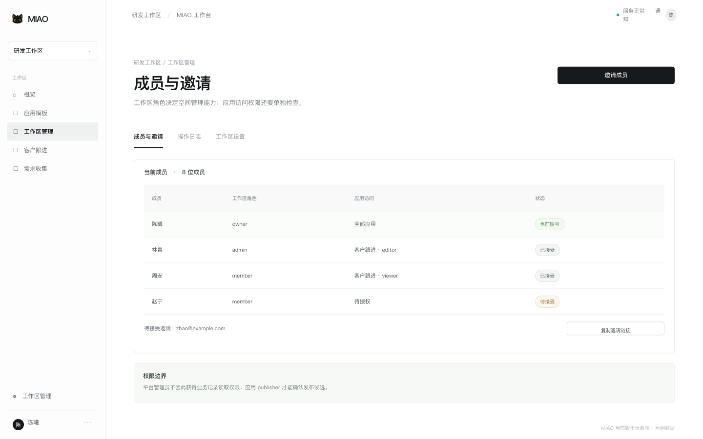

工作区管理入口包含“成员与邀请”“操作日志”和“工作区设置”。owner 管理空间和应用访问，admin 可以协助邀请和日常管理，member 使用被授予的应用。应用权限独立分为 viewer、editor、manager、publisher；批量修改另需 `can_batch`。

| 需要完成的事 | 由谁处理 |
| --- | --- |
| 邀请成员、撤销待处理邀请 | owner 或 admin |
| 调整成员角色、移出工作区、查看完整操作日志 | owner |
| 读取业务记录 | 获得对应应用访问的成员 |
| 新增、修改普通记录 | editor 或更高应用权限 |
| 管理草稿和应用配置 | manager、publisher 或 owner |
| 确认发布和匿名公开 | publisher、owner 或明确授权的运行操作者 |
| 查看平台账号、工作区元数据和 AI 服务 | 平台管理员；不因此获得业务内容权限 |

邀请链接与受邀邮箱绑定，24 小时内有效，撤销或过期后失效。成员被移出工作区后，全局账号仍可使用其他空间；旧页面、链接和 Agent 运行都会重新检查权限。

个人与 fx 的对话正文默认仅本人可见；应用版本摘要、任务回执、审计记录按其各自权限读取。Agent 不能绕过当前成员身份执行写入。

## 企业治理

**界面参考：**[HTML 原型](./prototypes/09-governance.html) · [原型图](./prototypes/images/09-governance.png)

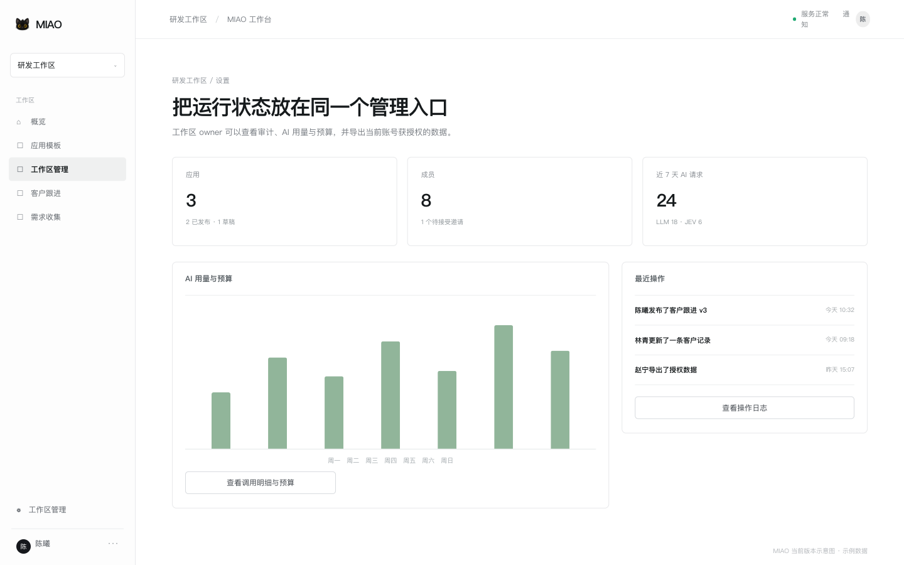

### 工作区设置

owner 可以在工作区设置中查看成员角色、AI 用量与预算、操作日志和授权数据导出。LLM 与 JEV 用量分开统计；请求数、token 数和供应商账单不是同一口径。

### 平台后台

平台管理员从账号菜单进入独立的平台后台，查看用户、工作区、应用目录、基本设置、AI 用量、平台审计和 AI 服务。平台管理员可以管理账号和运行配置，但不能浏览企业业务记录、附件内容或其他成员的私有对话正文。

### 自托管责任

自托管部署方负责域名与 HTTPS、注册和邮件策略、AI/Jev 密钥、平台管理员名单、备份目录、保留天数和恢复演练。配置密钥保存在服务端；不要把明文密钥放进截图、导出文件或 Git 仓库。当前 Go 服务按单实例方式运行，正式环境仍应按部署手册分层检查进程、SQLite、公开端点和登录后的业务流。

## 常见问题

**界面参考：**[HTML 原型](./prototypes/10-troubleshoot.html) · [原型图](./prototypes/images/10-troubleshoot.png)

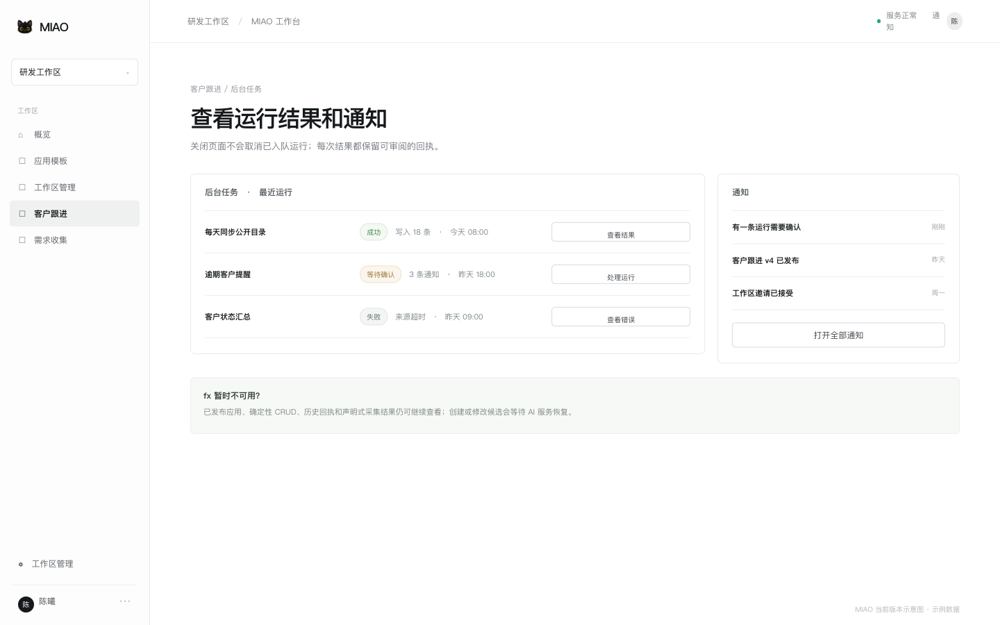

### 同事打不开应用

确认邮箱和工作区正确，再请 owner 检查应用访问名单和 viewer/editor 角色。链接不会自动授予权限。

### 草稿没有出现在正式应用

草稿、预览和正式版本独立存在。打开小助手运行记录和发布候选，确认是否完成发布；发布失败时原版本继续运行。

### 保存记录失败或出现冲突

先检查字段提示、权限和网络状态。发生并发冲突时重新读取最新记录，再重新提交；不要用刷新丢弃未提交输入。

### 后台任务一直等待或失败

打开应用的“后台任务”查看运行状态、版本、步骤和错误回执。等待确认的运行需要由具备权限的成员处理；来源超时、预算不足或脚本被暂停时不会自动重放未知写入。

### fx 无法回答或额度用尽

查看工作区 AI 用量与预算、平台后台的 AI 服务状态和最近请求。模型不可用时，已发布应用、确定性 CRUD、历史回执和可用的采集结果仍可继续访问。

### 找不到数据表或公开页面

“查看数据表”只在应用声明 `data_management` 能力时显示；没有该入口时仍可由小助手按权限查询底层数据。公开页面需要正式版本、公开策略、数据源字段和发布状态同时满足。

### 误发布、误删或写入结果未知

先停止后续操作，打开运行详情和审计记录。兼容的界面版本可以回退；未知写入先用核实接口检查当前记录，不要直接重复发送原请求。

## 完整示例

**界面参考：**[HTML 原型](./prototypes/11-example.html) · [原型图](./prototypes/images/11-example.png)

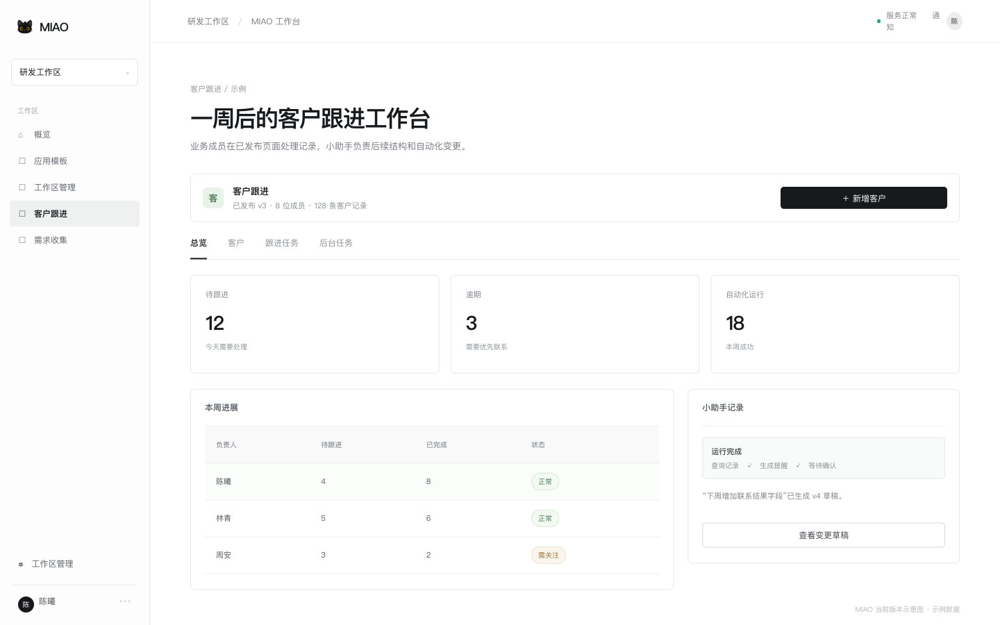

以“客户跟进”为例，一条完整的工作闭环可以这样展开：

1. 发起：负责人在小助手中说明销售、主管、客户、沟通记录和下一次行动，fx 追问可见范围和逾期定义。
2. 草稿：候选创建客户表、跟进记录表、状态流和总览页面；负责人确认后生成草稿。
3. 发布：负责人预览新增、编辑、状态转换和公开范围，具有 publisher 权限的成员确认发布。
4. 使用：销售在已发布页面新增客户、记录沟通、推进状态；主管按总览查看本周待跟进和逾期项。
5. 自动化：配置每天的公开目录采集和逾期提醒，查看每次运行的写入、通知和失败回执。
6. 迭代：一周后让小助手增加“联系结果”字段，阅读 v4 差异并在确认后发布；旧记录保持不变。
7. 治理：成员离职时先交接客户和应用责任，再移除工作区访问；通过操作日志和授权导出完成交接。

同一方法适用于需求收集、项目事项、采购申请等流程：先定义真实业务闭环，再用通用数据表、页面、动作、状态流和任务逐步扩展。

## 附录：技术架构

**界面参考：**[HTML 原型](./prototypes/12-architecture.html) · [原型图](./prototypes/images/12-architecture.png)

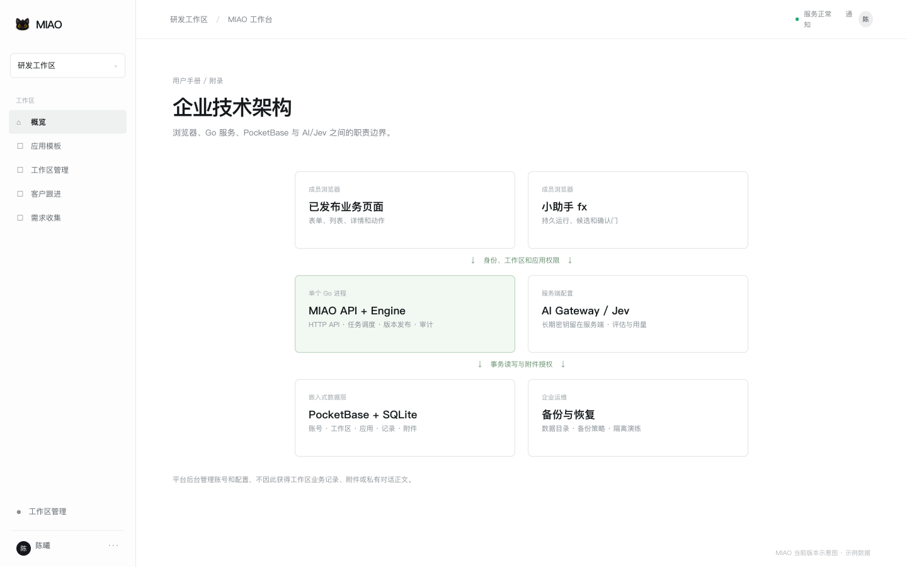

MIAO 当前由一个 Go 进程提供 HTTP API、嵌入式 PocketBase、浏览器 UI 和后台 worker。浏览器只发送当前身份和工作区上下文；服务端重新检查成员、应用和字段权限。

| 组成 | 职责 | 企业关注点 |
| --- | --- | --- |
| 浏览器工作台与已发布运行时 | 展示应用页面、表单、记录和任务回执 | 只读取当前账号获授权的数据；不执行用户源码 |
| 小助手 fx 与持久化 Engine | 处理需求、候选、确认、查询和受控写入 | 对话按账号隔离；模型文字不替代写入回执 |
| MIAO Go API | 身份、工作区、应用、版本、任务、公开发布和审计 | 每次请求检查成员和应用权限 |
| PocketBase + SQLite | 账号、工作区、应用定义、记录、附件和迁移 | 数据目录、备份、恢复与单实例边界 |
| AI Gateway / JEV | 转发模型请求、评估候选和记录用量 | 长期密钥只保存在服务端；AI 故障不阻断确定性业务页面 |
| 静态官网与本手册 | 提供公开介绍、操作说明和示意原型 | 与企业业务服务分开部署 |

正式应用引用已发布的 schema v3/json-render 版本；草稿、预览和正式页面有清晰边界。公开页面只返回显式授权的记录字段和图片。平台管理员与工作区业务权限分离，附件下载和导出也要重新授权。

源码、API 参考、部署和备份命令见 [MIAO 应用仓库](https://github.com/tans/miao)。本网站仓库只承载官网和用户手册。

---

企业部署方可以在交付给团队时补充自己的登录地址、支持联系人和内部数据政策。
